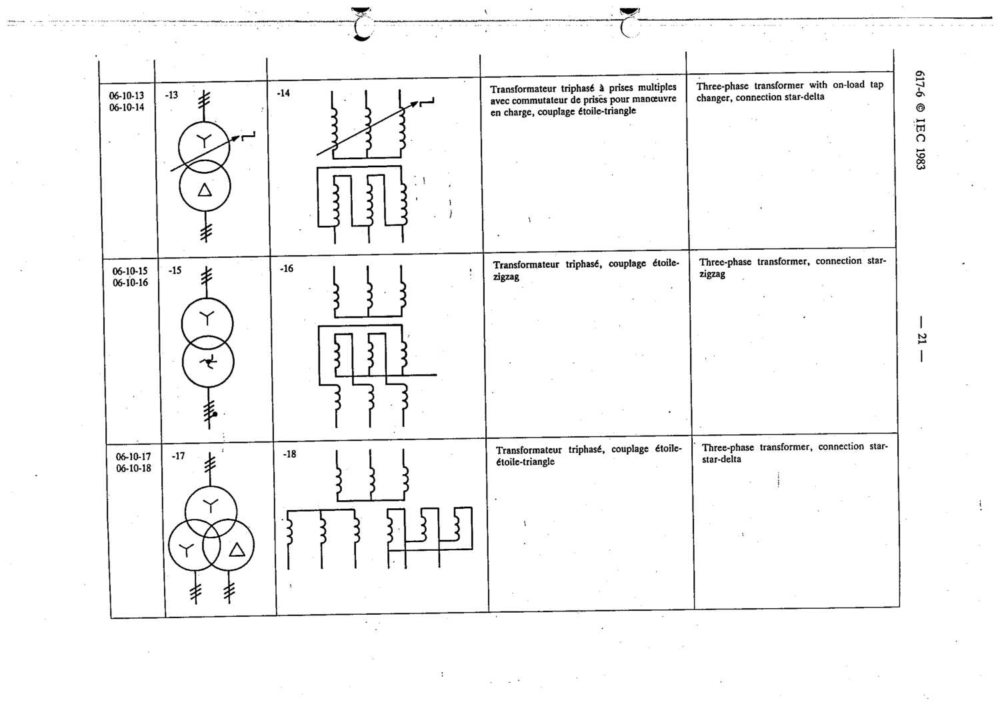

# 06-10-13 — Three-phase transformer with on-load tap changer, connection star-delta

This symbol appears on Publication No.617-6.pdf, printed p.21 (full page shown).

**Standard:** [[60617-6]] · **Section:** [[60617-6-10-examples-of-transformers-with]] · **Form 1**

## Description
Three-phase transformer with on-load tap changer, connection star-delta

## Names
- **EN:** Three-phase transformer with on-load tap changer, connection star-delta
- **FR:** Transformateur triphasé à prises multiples avec commutateur de prises en charge, couplage étoile-triangle

