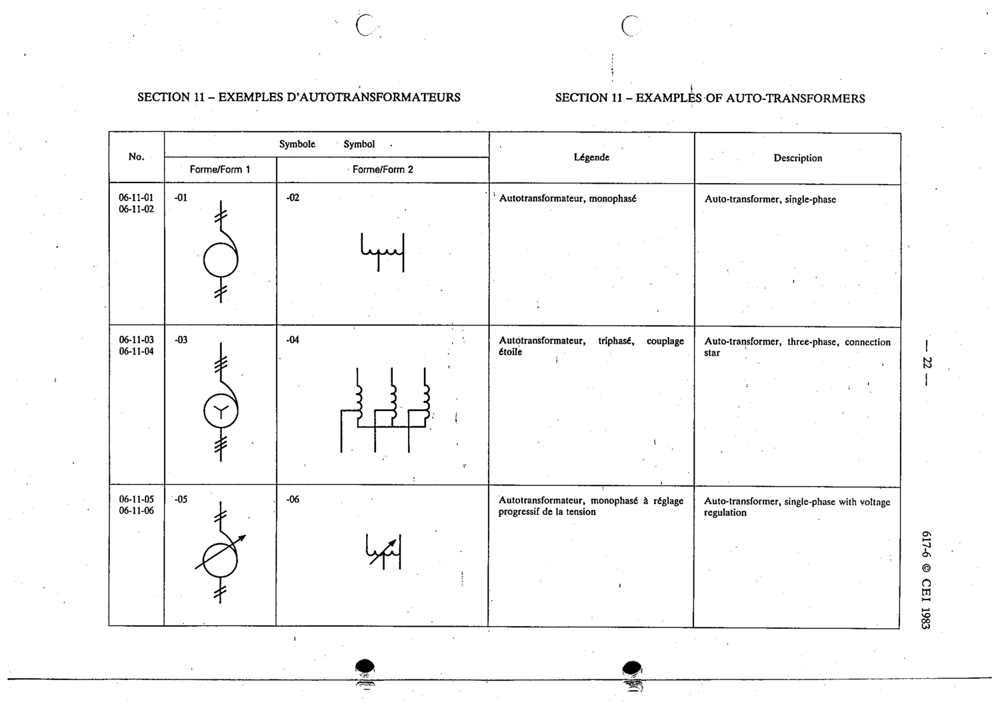

# 06-11-06 — Auto-transformer, single-phase with voltage regulation

This symbol appears on Publication No.617-6.pdf, printed p.22 (full page shown).

**Standard:** [[60617-6]] · **Section:** [[60617-6-11-examples-of-auto-transformers]] · **Form 2**

## Description
Auto-transformer, single-phase with voltage regulation

## Names
- **EN:** Auto-transformer, single-phase with voltage regulation
- **FR:** Autotransformateur, monophasé à réglage progressif de la tension

