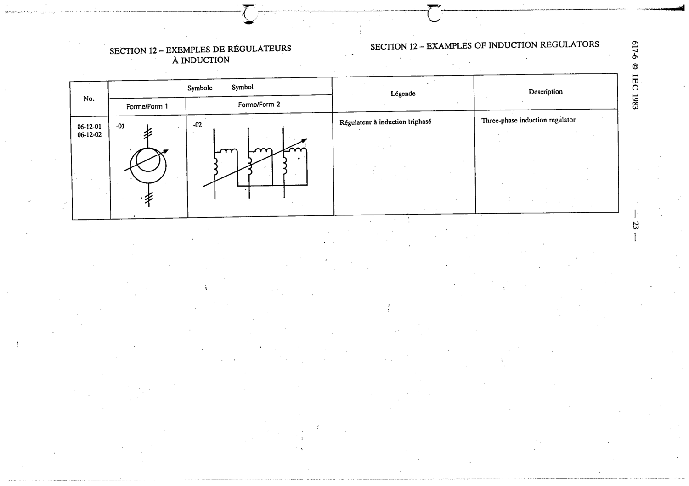

# 06-12-02 — Three-phase induction regulator

This symbol appears on Publication No.617-6.pdf, printed p.23 (full page shown).

**Standard:** [[60617-6]] · **Section:** [[60617-6-12-examples-of-induction-regulators]] · **Form 2**

## Description
Three-phase induction regulator

## Names
- **EN:** Three-phase induction regulator
- **FR:** Régulateur à induction triphasé

