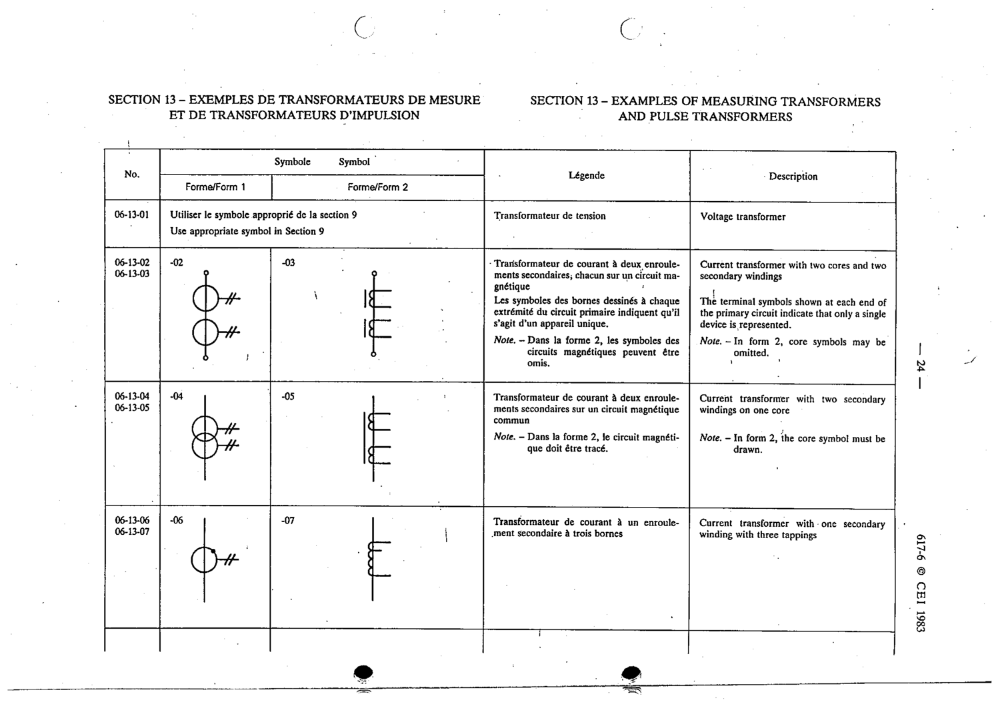

# 06-13-01 — Voltage transformer

This symbol appears on Publication No.617-6.pdf, printed p.24 (full page shown).

**Standard:** [[60617-6]] · **Section:** [[60617-6-13-examples-of-measuring-transformers]]

## Description
Voltage transformer. Use the appropriate symbol in Section 9.

## Names
- **EN:** Voltage transformer
- **FR:** Transformateur de tension

