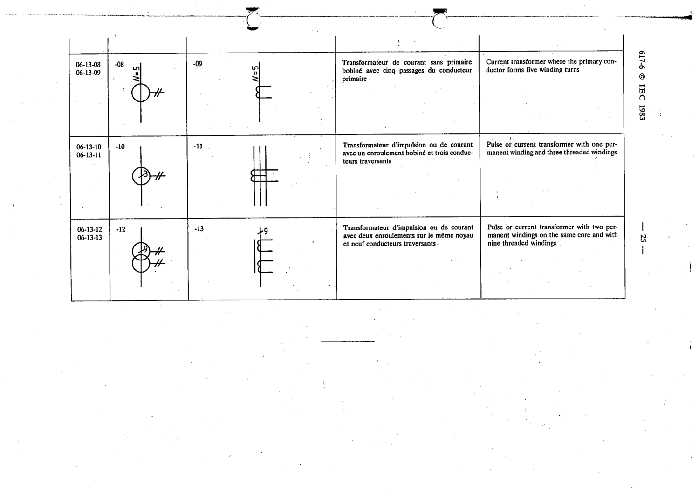

# 06-13-08 — Current transformer where the primary conductor forms five winding turns

This symbol appears on Publication No.617-6.pdf, printed p.25 (full page shown).

**Standard:** [[60617-6]] · **Section:** [[60617-6-13-examples-of-measuring-transformers]] · **Form 1**

## Description
Annotation N=5.

## Names
- **EN:** Current transformer where the primary conductor forms five winding turns
- **FR:** Transformateur de courant sans primaire bobiné avec cinq passages du conducteur primaire

