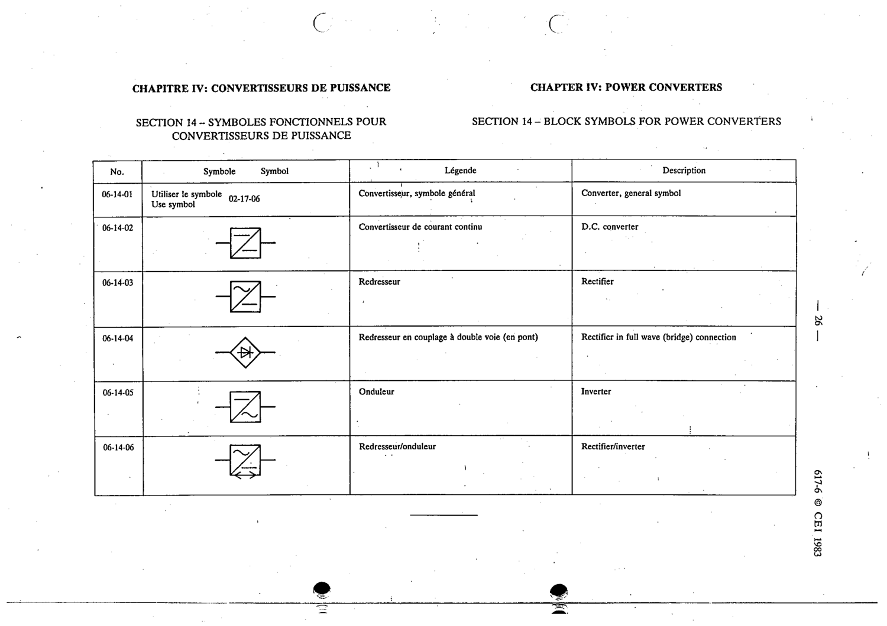

# 06-14-02 — D.C. converter

This symbol appears on Publication No.617-6.pdf, printed p.26 (full page shown).

**Standard:** [[60617-6]] · **Section:** [[60617-6-14-block-symbols-for-power]]

## Description
D.C. converter

## Names
- **EN:** D.C. converter
- **FR:** Convertisseur de courant continu

