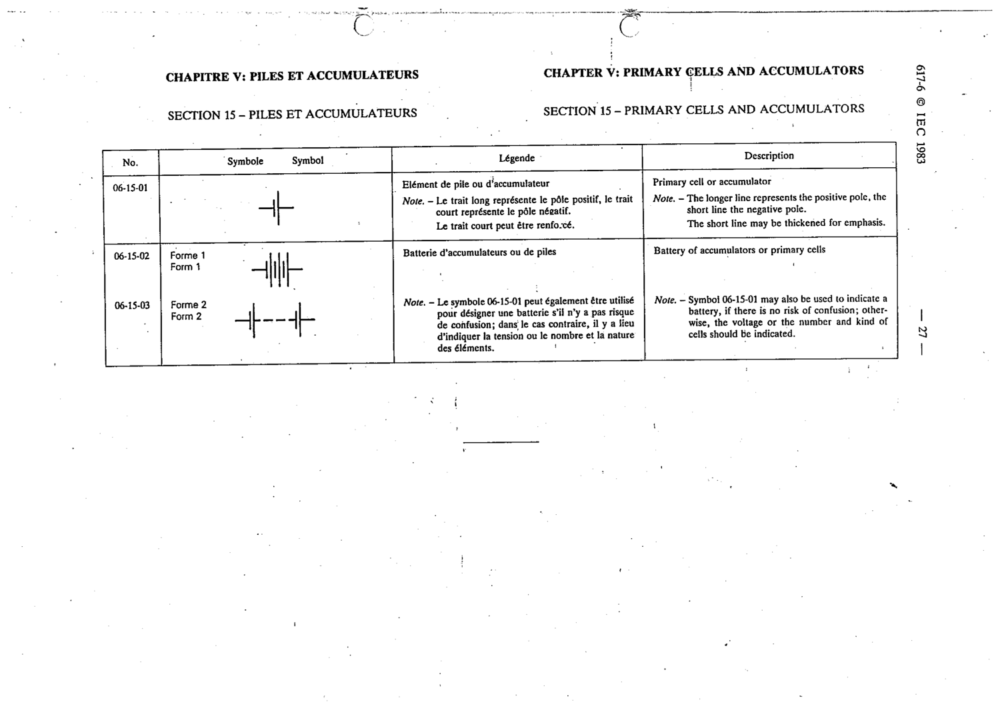

# 06-15-03 — Battery of accumulators or primary cells

This symbol appears on Publication No.617-6.pdf, printed p.27 (full page shown).

**Standard:** [[60617-6]] · **Section:** [[60617-6-15-primary-cells-and-accumulators]] · **Form 2**

## Description
Battery of accumulators or primary cells.

## Names
- **EN:** Battery of accumulators or primary cells
- **FR:** Batterie d'accumulateurs ou de piles

## Related
- [[06-15-01]]
