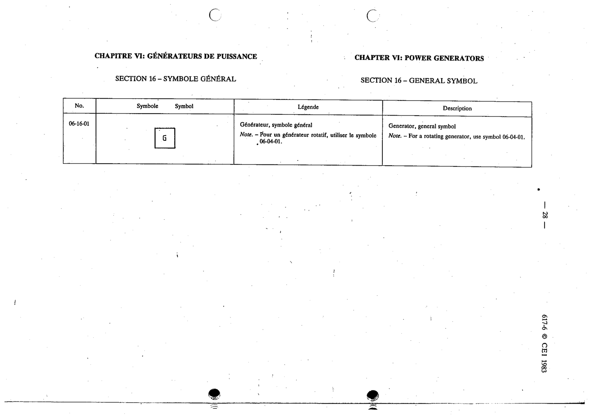

# 06-16-01 — Generator, general symbol

This symbol appears on Publication No.617-6.pdf, printed p.28 (full page shown).

**Standard:** [[60617-6]] · **Section:** [[60617-6-16-power-generators-general-symbol]]

## Description
Generator, general symbol.

## Names
- **EN:** Generator, general symbol
- **FR:** Générateur, symbole général

## Notes
- For a rotating generator, use symbol 06-04-01.

## Related
- [[06-04-01]]
