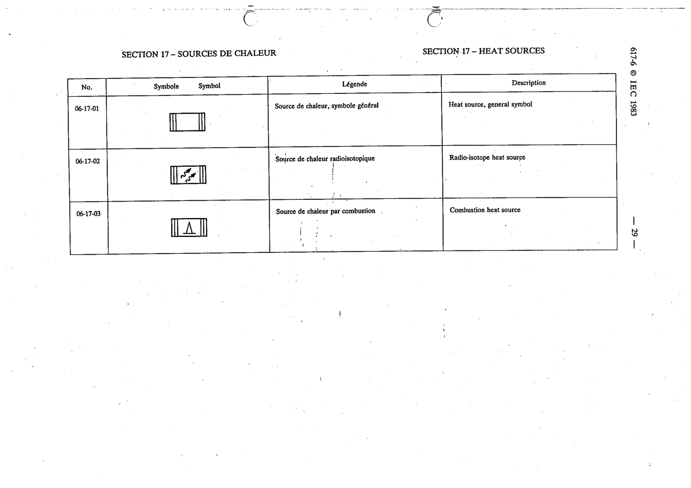

# 06-17-01 — Heat source, general symbol

This symbol appears on Publication No.617-6.pdf, printed p.29 (full page shown).

**Standard:** [[60617-6]] · **Section:** [[60617-6-17-heat-sources]]

## Description
Heat source, general symbol.

## Names
- **EN:** Heat source, general symbol
- **FR:** Source de chaleur, symbole général

