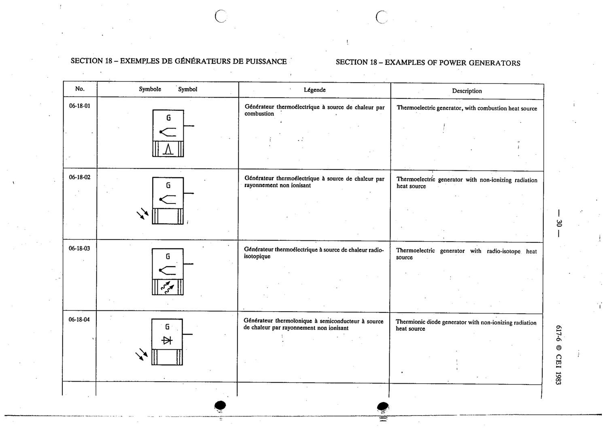

# 06-18-03 — Thermoelectric generator with radio-isotope heat source

This symbol appears on Publication No.617-6.pdf, printed p.30 (full page shown).

**Standard:** [[60617-6]] · **Section:** [[60617-6-18-examples-of-power-generators]]

## Description
Thermoelectric generator with radio-isotope heat source

## Names
- **EN:** Thermoelectric generator with radio-isotope heat source
- **FR:** Générateur thermoélectrique à source de chaleur radio-isotopique

