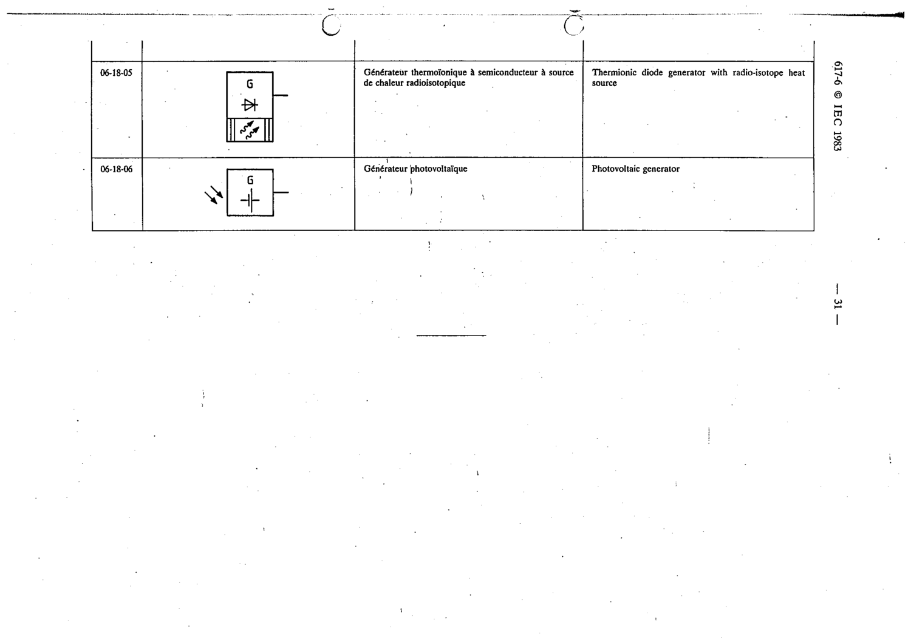

# 06-18-06 — Photovoltaic generator

This symbol appears on Publication No.617-6.pdf, printed p.31 (full page shown).

**Standard:** [[60617-6]] · **Section:** [[60617-6-18-examples-of-power-generators]]

## Description
Photovoltaic generator

## Names
- **EN:** Photovoltaic generator
- **FR:** Générateur photovoltaïque

