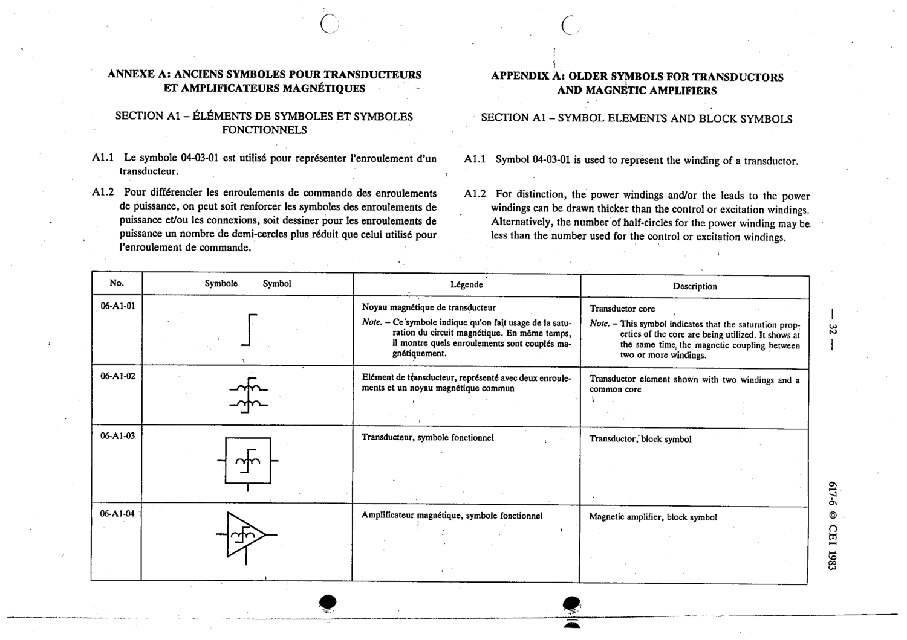

# 06-A1-03 — Transductor, block symbol

This symbol appears on Publication No.617-6.pdf, printed p.32 (full page shown).

**Standard:** [[60617-6]] · **Section:** [[60617-6-A1-appendix-a-older-symbols]]

## Description
Transductor, block symbol

## Names
- **EN:** Transductor, block symbol
- **FR:** Transducteur, symbole fonctionnel

