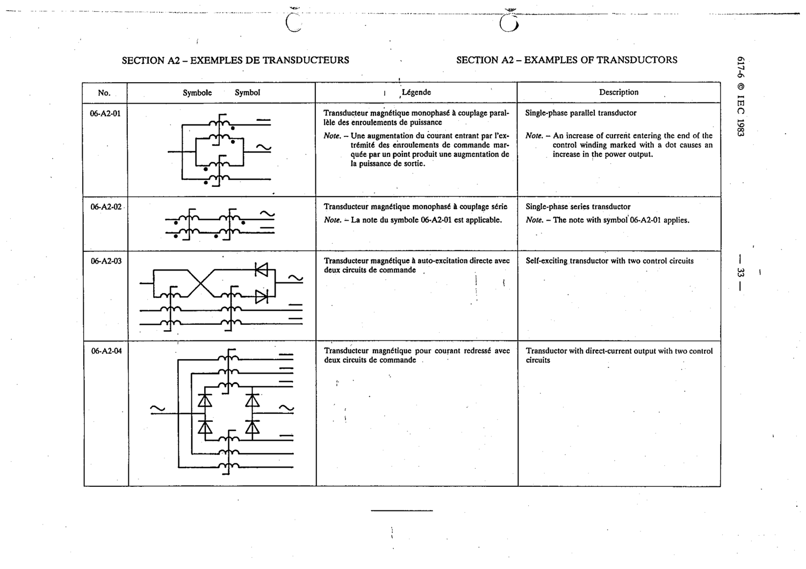

# 06-A2-04 — Transductor with direct-current output with two control circuits

This symbol appears on Publication No.617-6.pdf, printed p.33 (full page shown).

**Standard:** [[60617-6]] · **Section:** [[60617-6-A2-appendix-a-older-symbols]]

## Description
Transductor with direct-current output with two control circuits

## Names
- **EN:** Transductor with direct-current output with two control circuits
- **FR:** Transducteur magnétique pour courant redressé avec deux circuits de commande

