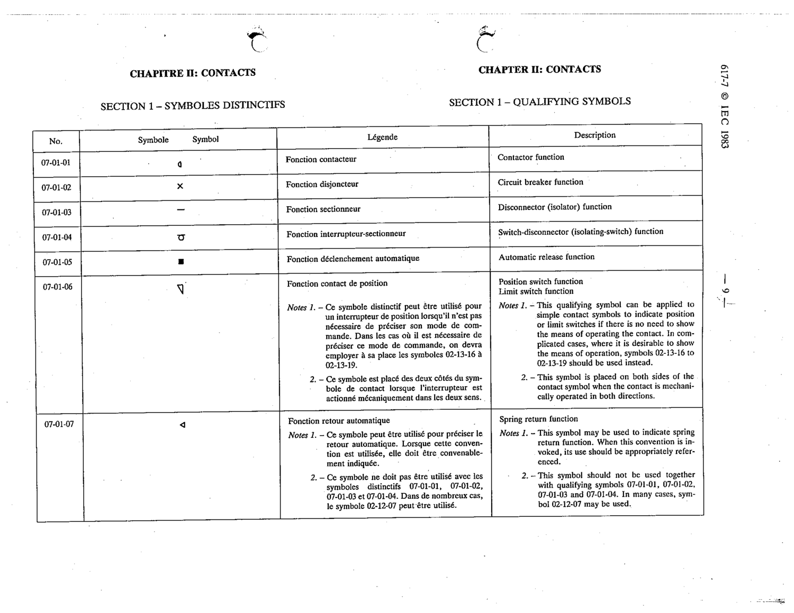

# 07-01-01 — Contactor function

This symbol appears on Publication No.617-7.pdf, printed p.9 (full page shown). 617-7 uses page-level images: its table layout is too irregular (intro text, notes, text-only rows) for reliable per-symbol cropping.

**Standard:** [[60617-7]] · **Section:** [[60617-7-01-qualifying-symbols]]

## Description
Contactor function

## Names
- **EN:** Contactor function
- **FR:** Fonction contacteur

