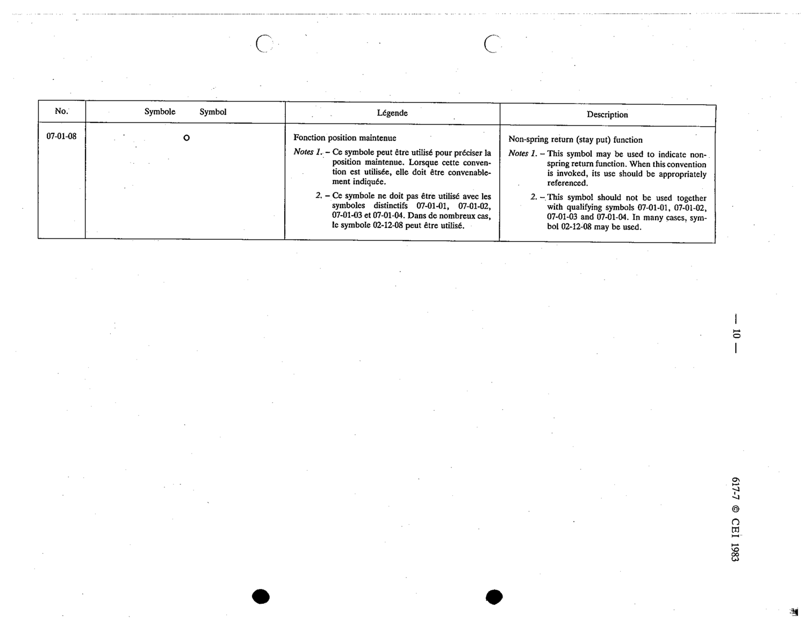

# 07-01-08 — Non-spring return (stay put) function

This symbol appears on Publication No.617-7.pdf, printed p.10 (full page shown). 617-7 uses page-level images: its table layout is too irregular (intro text, notes, text-only rows) for reliable per-symbol cropping.

**Standard:** [[60617-7]] · **Section:** [[60617-7-01-qualifying-symbols]]

## Description
Non-spring return (stay put) function

## Names
- **EN:** Non-spring return (stay put) function
- **FR:** Fonction position maintenue

## Notes
- This symbol may be used to indicate non-spring return function. When this convention is invoked, its use should be appropriately referenced.
- This symbol should not be used together with qualifying symbols 07-01-01..04. In many cases, symbol 02-12-08 may be used.

## Related
- [[07-01-01]]
- [[07-01-02]]
- [[07-01-03]]
- [[07-01-04]]
- [[02-12-08]]
