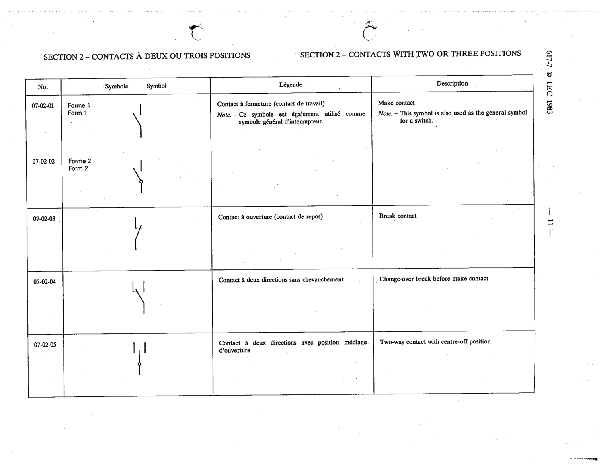

# 07-02-02 — Make contact

This symbol appears on Publication No.617-7.pdf, printed p.11 (full page shown). 617-7 uses page-level images: its table layout is too irregular (intro text, notes, text-only rows) for reliable per-symbol cropping.

**Standard:** [[60617-7]] · **Section:** [[60617-7-02-contacts-with-two-or]] · **Form 2**

## Description
Make contact

## Names
- **EN:** Make contact
- **FR:** Contact à fermeture (contact de travail)

