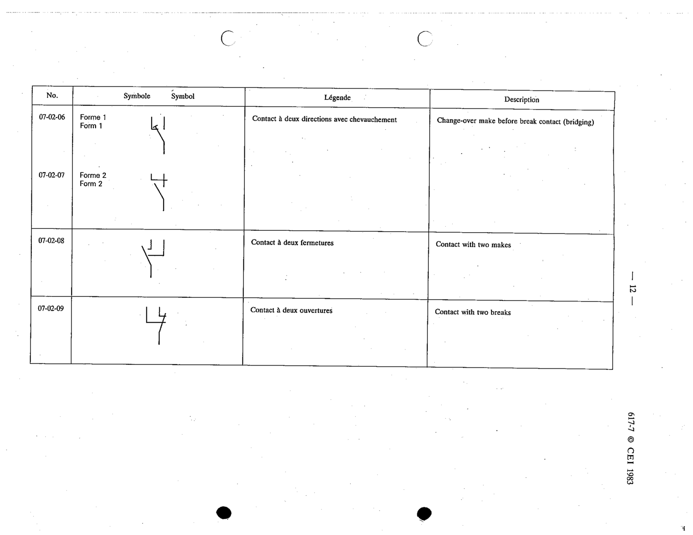

# 07-02-09 — Contact with two breaks

This symbol appears on Publication No.617-7.pdf, printed p.12 (full page shown). 617-7 uses page-level images: its table layout is too irregular (intro text, notes, text-only rows) for reliable per-symbol cropping.

**Standard:** [[60617-7]] · **Section:** [[60617-7-02-contacts-with-two-or]]

## Description
Contact with two breaks

## Names
- **EN:** Contact with two breaks
- **FR:** Contact à deux ouvertures

