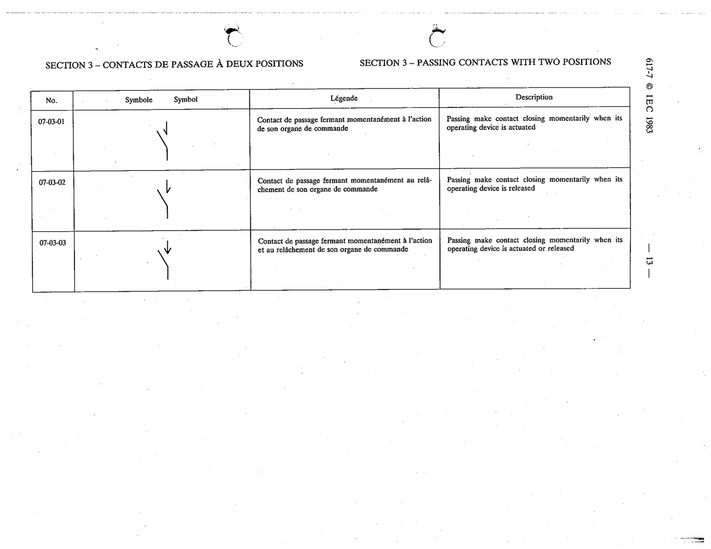

# 07-03-03 — Passing make contact closing momentarily when its operating device is actuated or released

This symbol appears on Publication No.617-7.pdf, printed p.13 (full page shown). 617-7 uses page-level images: its table layout is too irregular (intro text, notes, text-only rows) for reliable per-symbol cropping.

**Standard:** [[60617-7]] · **Section:** [[60617-7-03-passing-contacts-with-two]]

## Description
Passing make contact closing momentarily when its operating device is actuated or released

## Names
- **EN:** Passing make contact closing momentarily when its operating device is actuated or released
- **FR:** Contact de passage fermant momentanément à l'action et au relâchement de son organe de commande

