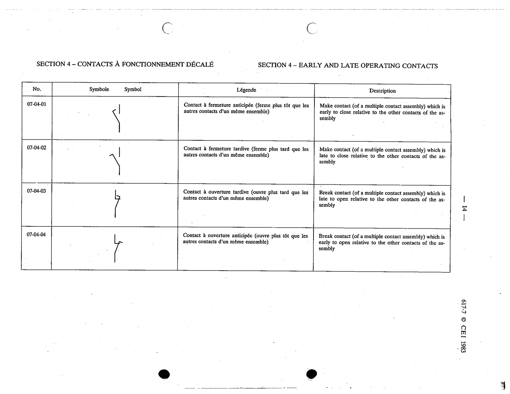

# 07-04-03 — Break contact, late to open relative to other contacts of the assembly

This symbol appears on Publication No.617-7.pdf, printed p.14 (full page shown). 617-7 uses page-level images: its table layout is too irregular (intro text, notes, text-only rows) for reliable per-symbol cropping.

**Standard:** [[60617-7]] · **Section:** [[60617-7-04-early-and-late-operating]]

## Description
Break contact (of a multiple contact assembly) which is late to open relative to the other contacts of the assembly

## Names
- **EN:** Break contact, late to open relative to other contacts of the assembly
- **FR:** Contact à ouverture tardive

