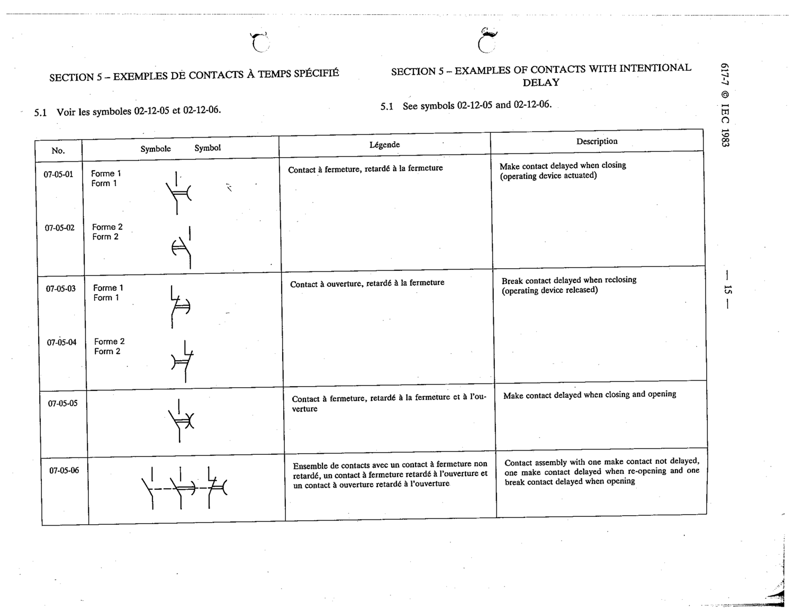

# 07-05-06 — Contact assembly: one make not delayed, one make delayed when re-opening, one break delayed when opening

This symbol appears on Publication No.617-7.pdf, printed p.15 (full page shown). 617-7 uses page-level images: its table layout is too irregular (intro text, notes, text-only rows) for reliable per-symbol cropping.

**Standard:** [[60617-7]] · **Section:** [[60617-7-05-examples-of-contacts-with]]

## Description
Contact assembly with one make contact not delayed, one make contact delayed when re-opening and one break contact delayed when opening

## Names
- **EN:** Contact assembly: one make not delayed, one make delayed when re-opening, one break delayed when opening
- **FR:** Ensemble de contacts à temporisations différentes

