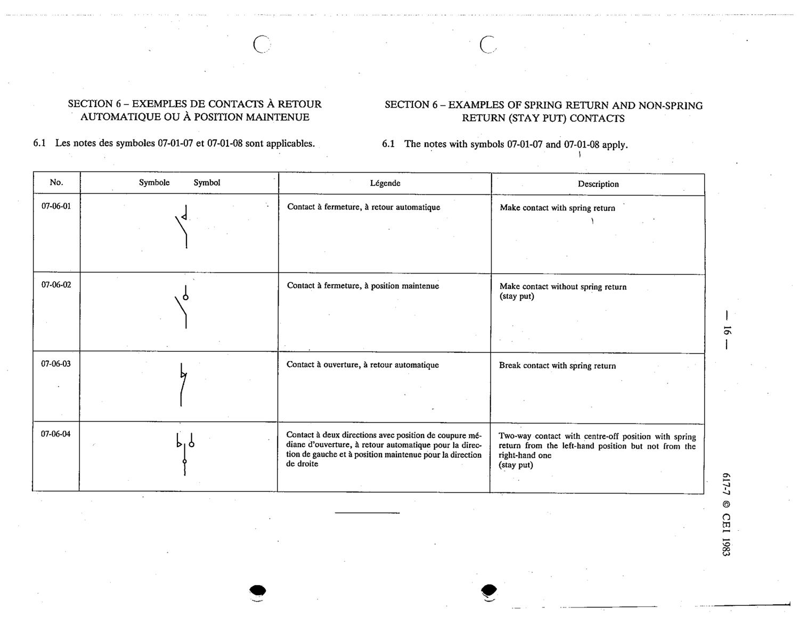

# 07-06-02 — Make contact without spring return (stay put)

This symbol appears on Publication No.617-7.pdf, printed p.16 (full page shown). 617-7 uses page-level images: its table layout is too irregular (intro text, notes, text-only rows) for reliable per-symbol cropping.

**Standard:** [[60617-7]] · **Section:** [[60617-7-06-examples-of-spring-return]]

## Description
Make contact without spring return (stay put)

## Names
- **EN:** Make contact without spring return (stay put)
- **FR:** Contact à fermeture, à position maintenue

