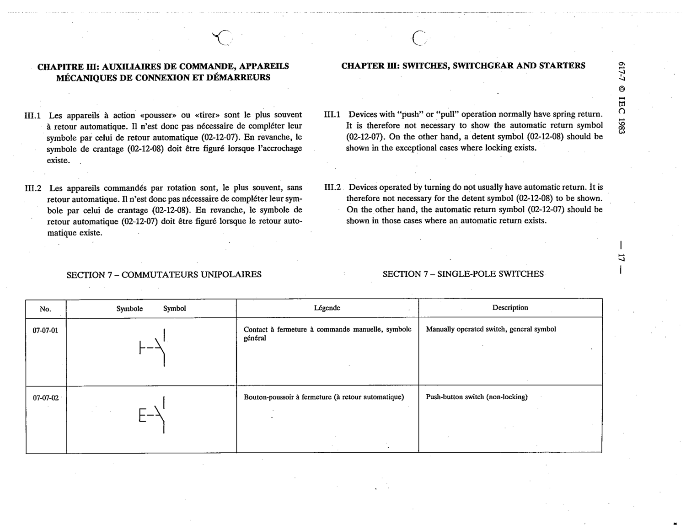

# 07-07-02 — Push-button switch (non-locking)

This symbol appears on Publication No.617-7.pdf, printed p.17 (full page shown). 617-7 uses page-level images: its table layout is too irregular (intro text, notes, text-only rows) for reliable per-symbol cropping.

**Standard:** [[60617-7]] · **Section:** [[60617-7-07-single-pole-switches]]

## Description
Push-button switch (non-locking)

## Names
- **EN:** Push-button switch (non-locking)
- **FR:** Bouton-poussoir à fermeture (à retour automatique)

