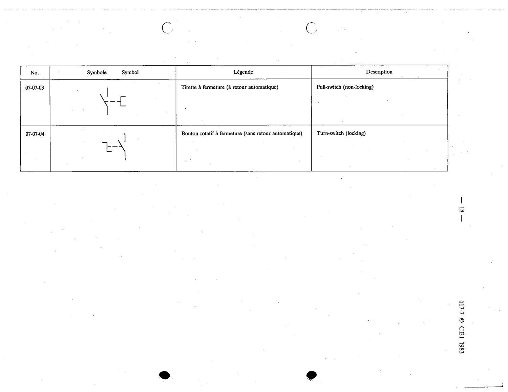

# 07-07-04 — Turn-switch (locking)

This symbol appears on Publication No.617-7.pdf, printed p.18 (full page shown). 617-7 uses page-level images: its table layout is too irregular (intro text, notes, text-only rows) for reliable per-symbol cropping.

**Standard:** [[60617-7]] · **Section:** [[60617-7-07-single-pole-switches]]

## Description
Turn-switch (locking)

## Names
- **EN:** Turn-switch (locking)
- **FR:** Bouton rotatif à fermeture (sans retour automatique)

