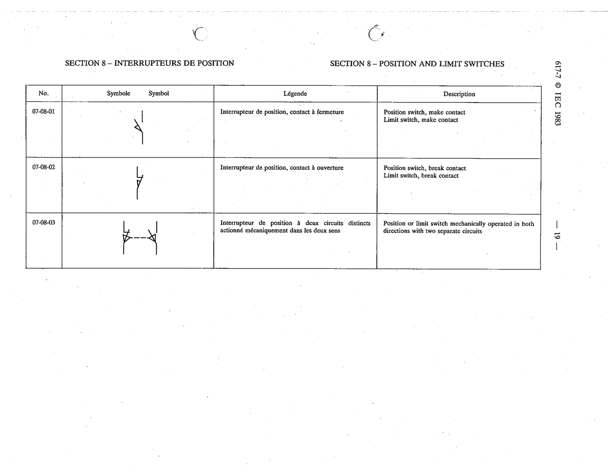

# 07-08-01 — Position switch, make contact / Limit switch, make contact

This symbol appears on Publication No.617-7.pdf, printed p.19 (full page shown). 617-7 uses page-level images: its table layout is too irregular (intro text, notes, text-only rows) for reliable per-symbol cropping.

**Standard:** [[60617-7]] · **Section:** [[60617-7-08-position-and-limit-switches]]

## Description
Position switch, make contact / Limit switch, make contact

## Names
- **EN:** Position switch, make contact / Limit switch, make contact
- **FR:** Interrupteur de position, contact à fermeture

