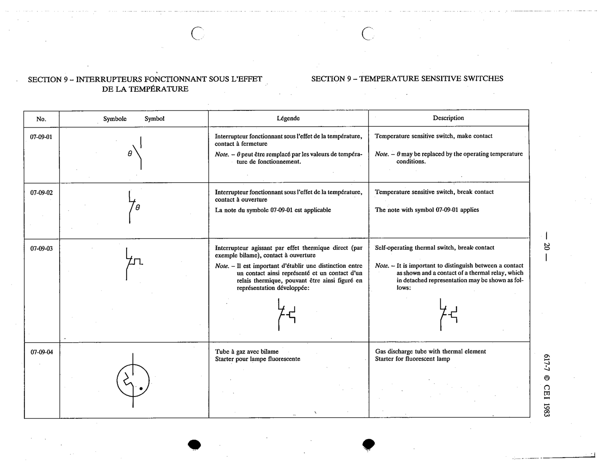

# 07-09-01 — Temperature sensitive switch, make contact

This symbol appears on Publication No.617-7.pdf, printed p.20 (full page shown). 617-7 uses page-level images: its table layout is too irregular (intro text, notes, text-only rows) for reliable per-symbol cropping.

**Standard:** [[60617-7]] · **Section:** [[60617-7-09-temperature-sensitive-switches]]

## Description
Temperature sensitive switch, make contact

## Names
- **EN:** Temperature sensitive switch, make contact
- **FR:** Interrupteur fonctionnant sous l'effet de la température, contact à fermeture

## Notes
- θ may be replaced by the operating temperature conditions.

