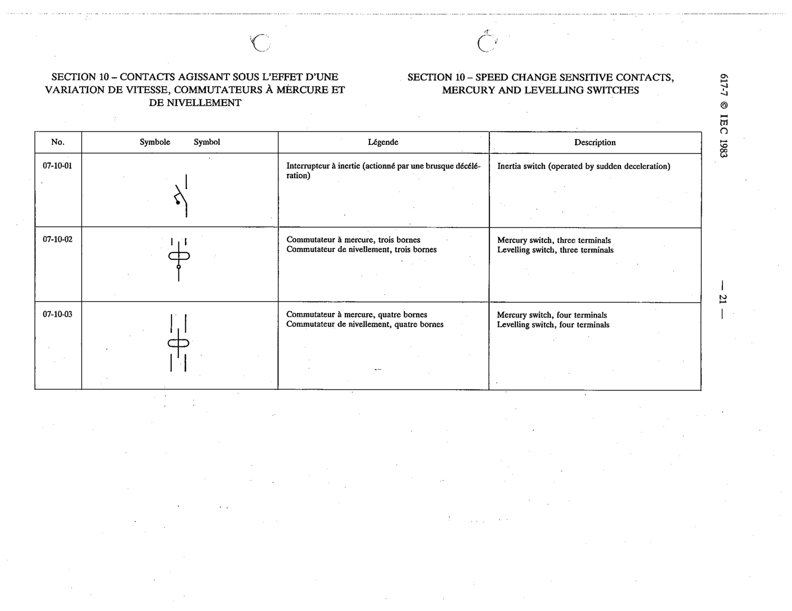

# 07-10-03 — Mercury switch, four terminals / Levelling switch, four terminals

This symbol appears on Publication No.617-7.pdf, printed p.21 (full page shown). 617-7 uses page-level images: its table layout is too irregular (intro text, notes, text-only rows) for reliable per-symbol cropping.

**Standard:** [[60617-7]] · **Section:** [[60617-7-10-speed-change-sensitive-contacts]]

## Description
Mercury switch, four terminals / Levelling switch, four terminals

## Names
- **EN:** Mercury switch, four terminals / Levelling switch, four terminals
- **FR:** Commutateur à mercure, quatre bornes / Commutateur de nivellement, quatre bornes

