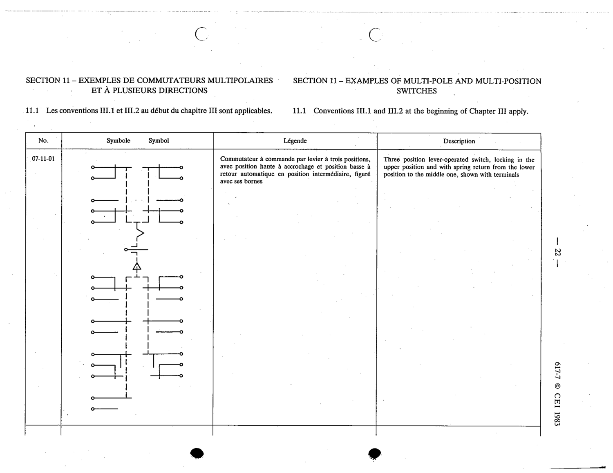

# 07-11-01 — Three-position lever-operated switch, locking upper, spring return lower to middle, shown with terminals

This symbol appears on Publication No.617-7.pdf, printed p.22 (full page shown). 617-7 uses page-level images: its table layout is too irregular (intro text, notes, text-only rows) for reliable per-symbol cropping.

**Standard:** [[60617-7]] · **Section:** [[60617-7-11-examples-of-multi-pole]]

## Description
Three position lever-operated switch, locking in the upper position and with spring return from the lower position to the middle one, shown with terminals

## Names
- **EN:** Three-position lever-operated switch, locking upper, spring return lower to middle, shown with terminals
- **FR:** Commutateur à commande par levier à trois positions, position haute à accrochage et position basse à retour automatique en position intermédiaire, figuré avec ses bornes

