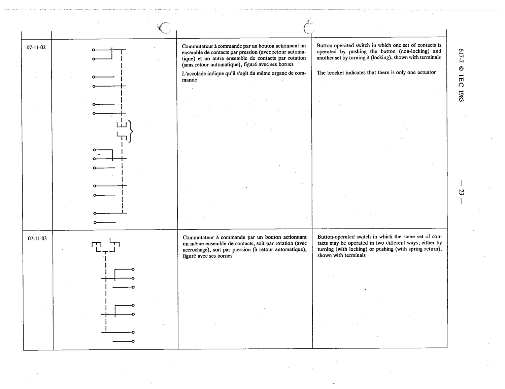

# 07-11-02 — Button-operated switch: one contact set by pushing (non-locking), another by turning (locking), shown with terminals

This symbol appears on Publication No.617-7.pdf, printed p.23 (full page shown). 617-7 uses page-level images: its table layout is too irregular (intro text, notes, text-only rows) for reliable per-symbol cropping.

**Standard:** [[60617-7]] · **Section:** [[60617-7-11-examples-of-multi-pole]]

## Description
Button-operated switch in which one set of contacts is operated by pushing the button (non-locking) and another set by turning it (locking), shown with terminals

## Names
- **EN:** Button-operated switch: one contact set by pushing (non-locking), another by turning (locking), shown with terminals
- **FR:** Commutateur à commande par un bouton actionnant un ensemble de contacts par pression et un autre par rotation, figuré avec ses bornes

## Notes
- The bracket indicates that there is only one actuator.

