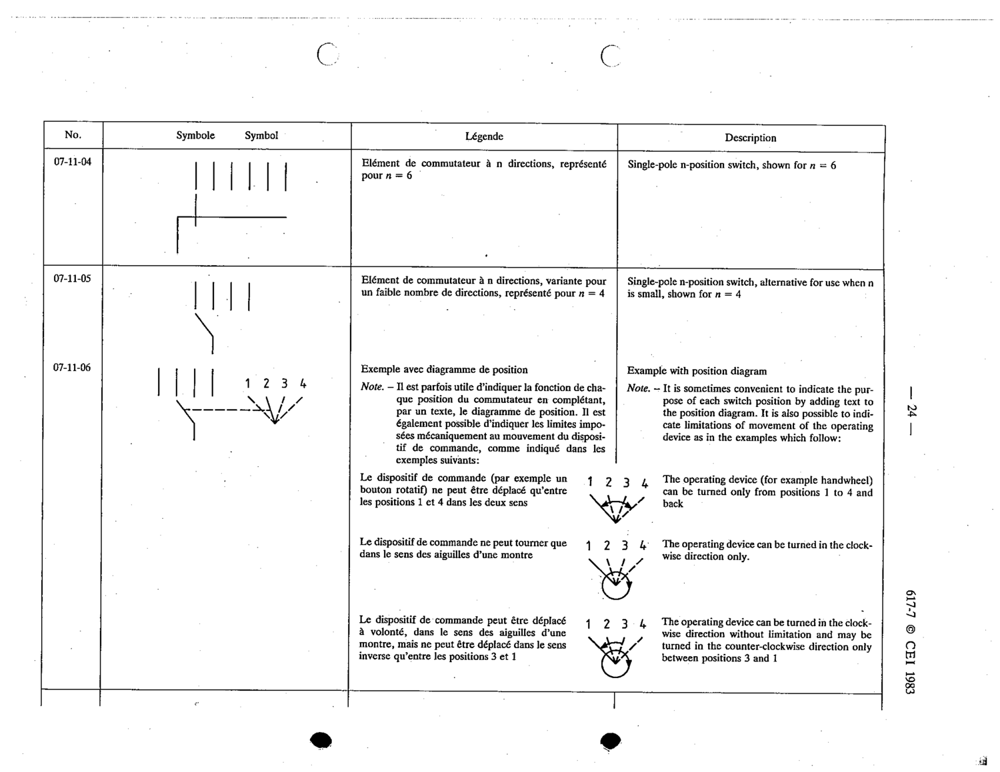

# 07-11-06 — Example with position diagram

This symbol appears on Publication No.617-7.pdf, printed p.24 (full page shown). 617-7 uses page-level images: its table layout is too irregular (intro text, notes, text-only rows) for reliable per-symbol cropping.

**Standard:** [[60617-7]] · **Section:** [[60617-7-11-examples-of-multi-pole]]

## Description
Example with position diagram. It is sometimes convenient to indicate the purpose of each switch position by adding text to the position diagram, and to indicate limitations of movement of the operating device.

## Names
- **EN:** Example with position diagram
- **FR:** Exemple avec diagramme de position

## Notes
- The operating device can be turned only from positions 1 to 4 and back.
- The operating device can be turned in the clockwise direction only.
- The operating device can be turned clockwise without limitation, but counter-clockwise only between positions 3 and 1.

