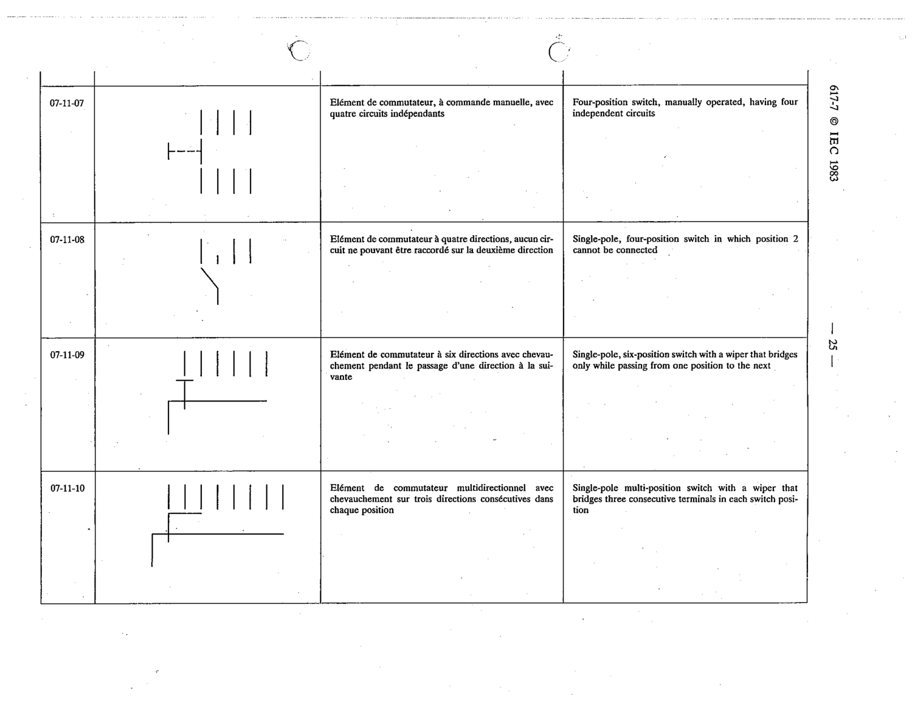

# 07-11-07 — Four-position switch, manually operated, having four independent circuits

This symbol appears on Publication No.617-7.pdf, printed p.25 (full page shown). 617-7 uses page-level images: its table layout is too irregular (intro text, notes, text-only rows) for reliable per-symbol cropping.

**Standard:** [[60617-7]] · **Section:** [[60617-7-11-examples-of-multi-pole]]

## Description
Four-position switch, manually operated, having four independent circuits

## Names
- **EN:** Four-position switch, manually operated, having four independent circuits
- **FR:** Élément de commutateur, à commande manuelle, avec quatre circuits indépendants

