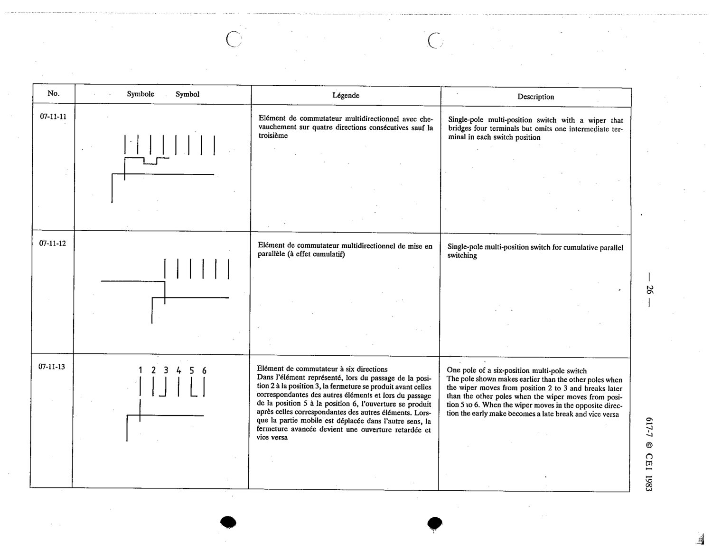

# 07-11-12 — Single-pole multi-position switch for cumulative parallel switching

This symbol appears on Publication No.617-7.pdf, printed p.26 (full page shown). 617-7 uses page-level images: its table layout is too irregular (intro text, notes, text-only rows) for reliable per-symbol cropping.

**Standard:** [[60617-7]] · **Section:** [[60617-7-11-examples-of-multi-pole]]

## Description
Single-pole multi-position switch for cumulative parallel switching

## Names
- **EN:** Single-pole multi-position switch for cumulative parallel switching
- **FR:** Élément de commutateur multidirectionnel de mise en parallèle (à effet cumulatif)

