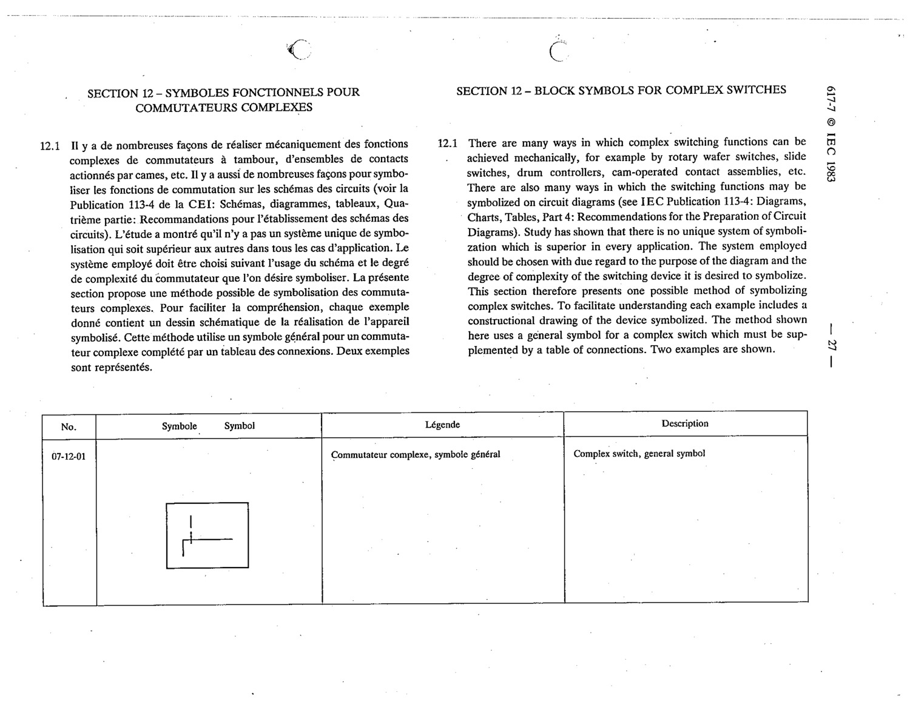

# 07-12-01 — Complex switch, general symbol

This symbol appears on Publication No.617-7.pdf, printed p.27 (full page shown). 617-7 uses page-level images: its table layout is too irregular (intro text, notes, text-only rows) for reliable per-symbol cropping.

**Standard:** [[60617-7]] · **Section:** [[60617-7-12-block-symbols-for-complex]]

## Description
Complex switch, general symbol

## Names
- **EN:** Complex switch, general symbol
- **FR:** Commutateur complexe, symbole général

## Related
- **IEC 113-4**
