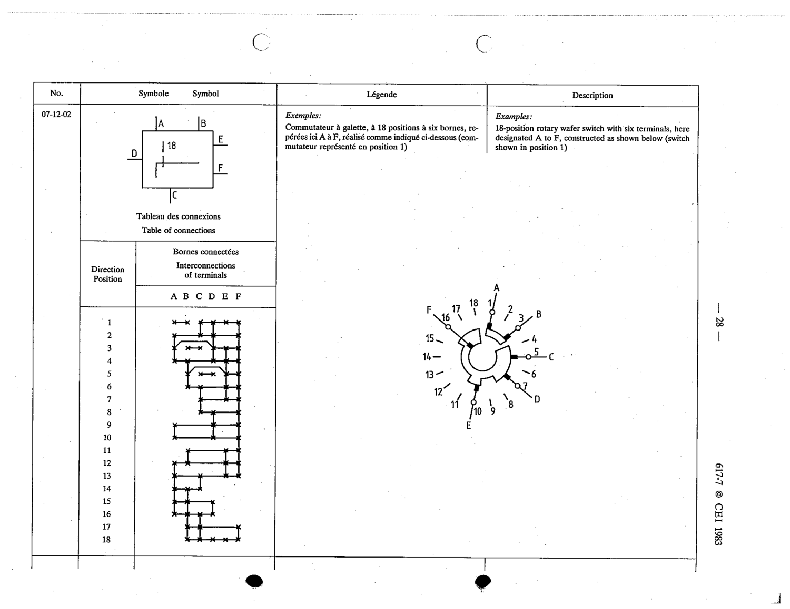

# 07-12-02 — 18-position rotary wafer switch with six terminals (A to F), shown in position 1

This symbol appears on Publication No.617-7.pdf, printed p.28 (full page shown). 617-7 uses page-level images: its table layout is too irregular (intro text, notes, text-only rows) for reliable per-symbol cropping.

**Standard:** [[60617-7]] · **Section:** [[60617-7-12-block-symbols-for-complex]]

## Description
18-position rotary wafer switch with six terminals, here designated A to F, constructed as shown below (switch shown in position 1)

## Names
- **EN:** 18-position rotary wafer switch with six terminals (A to F), shown in position 1
- **FR:** Commutateur à galette, à 18 positions à six bornes, repérées ici A à F, représenté en position 1

