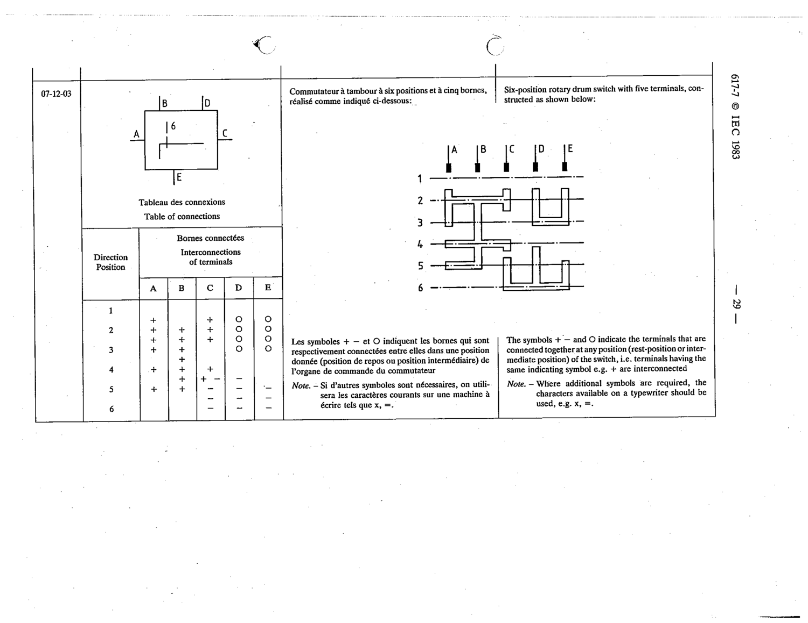

# 07-12-03 — Six-position rotary drum switch with five terminals

This symbol appears on Publication No.617-7.pdf, printed p.29 (full page shown). 617-7 uses page-level images: its table layout is too irregular (intro text, notes, text-only rows) for reliable per-symbol cropping.

**Standard:** [[60617-7]] · **Section:** [[60617-7-12-block-symbols-for-complex]]

## Description
Six-position rotary drum switch with five terminals. The symbols +, - and O indicate the terminals connected together at any position; terminals having the same symbol are interconnected.

## Names
- **EN:** Six-position rotary drum switch with five terminals
- **FR:** Commutateur à tambour à six positions et à cinq bornes

## Notes
- Where additional symbols are required, the characters available on a typewriter should be used, e.g. x, =.

