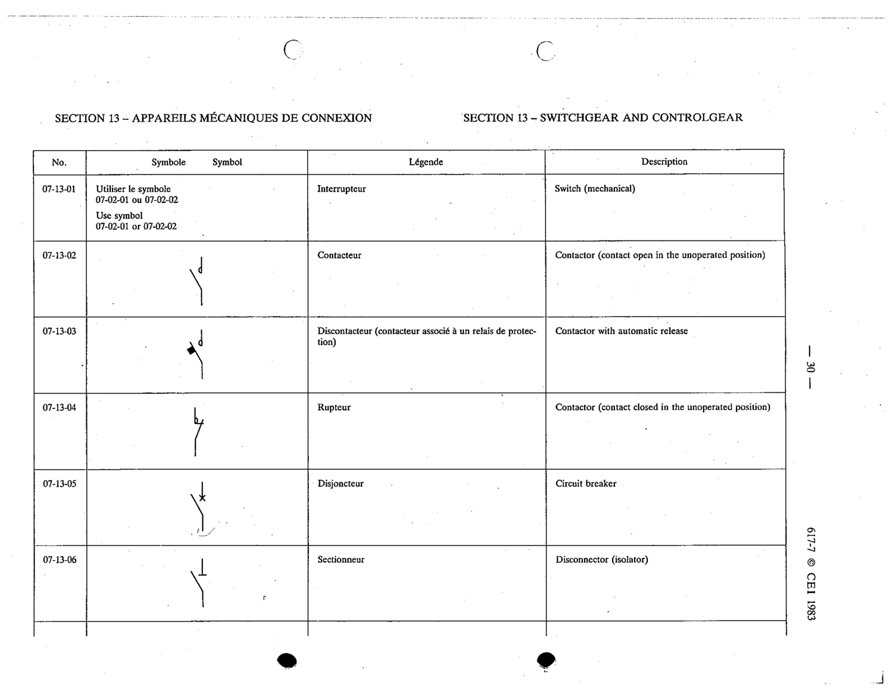

# 07-13-01 — Switch (mechanical)

This symbol appears on Publication No.617-7.pdf, printed p.30 (full page shown). 617-7 uses page-level images: its table layout is too irregular (intro text, notes, text-only rows) for reliable per-symbol cropping.

**Standard:** [[60617-7]] · **Section:** [[60617-7-13-switchgear-and-controlgear]]

## Description
Switch (mechanical). Use symbol 07-02-01 or 07-02-02.

## Names
- **EN:** Switch (mechanical)
- **FR:** Interrupteur

## Notes
- Use symbol 07-02-01 or 07-02-02.

## Related
- [[07-02-01]]
- [[07-02-02]]
