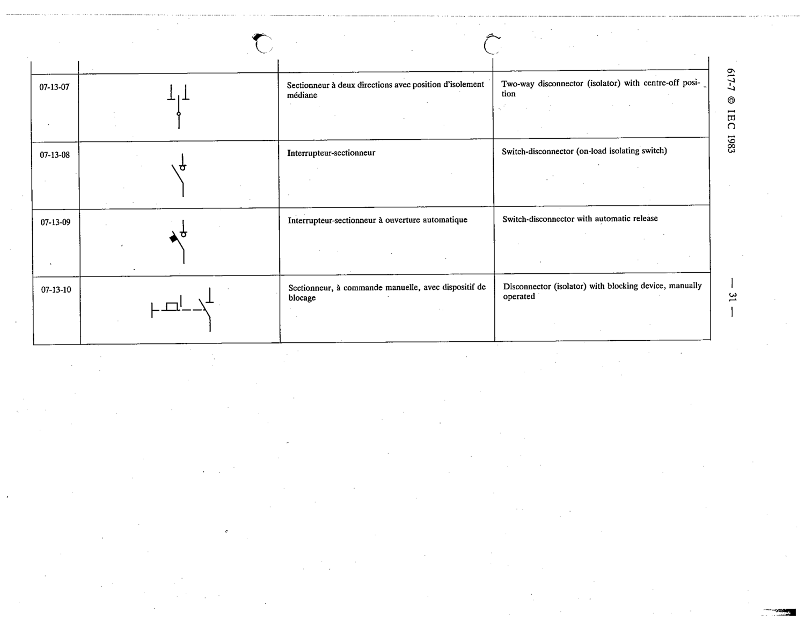

# 07-13-07 — Two-way disconnector (isolator) with centre-off position

This symbol appears on Publication No.617-7.pdf, printed p.31 (full page shown). 617-7 uses page-level images: its table layout is too irregular (intro text, notes, text-only rows) for reliable per-symbol cropping.

**Standard:** [[60617-7]] · **Section:** [[60617-7-13-switchgear-and-controlgear]]

## Description
Two-way disconnector (isolator) with centre-off position

## Names
- **EN:** Two-way disconnector (isolator) with centre-off position
- **FR:** Sectionneur à deux directions avec position d'isolement médiane

