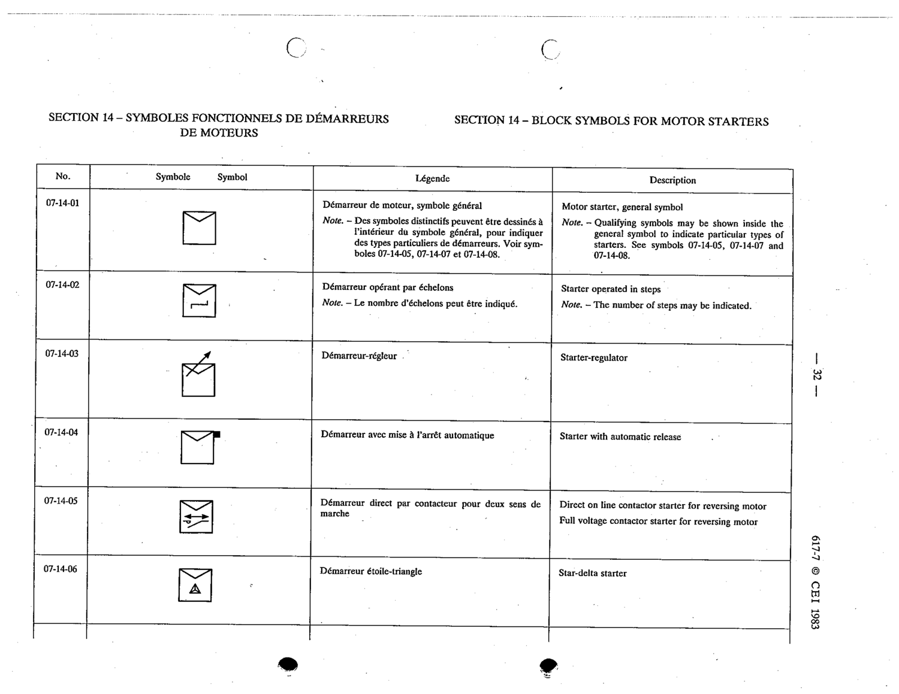

# 07-14-01 — Motor starter, general symbol

This symbol appears on Publication No.617-7.pdf, printed p.32 (full page shown). 617-7 uses page-level images: its table layout is too irregular (intro text, notes, text-only rows) for reliable per-symbol cropping.

**Standard:** [[60617-7]] · **Section:** [[60617-7-14-block-symbols-for-motor]]

## Description
Motor starter, general symbol

## Names
- **EN:** Motor starter, general symbol
- **FR:** Démarreur de moteur, symbole général

## Notes
- Qualifying symbols may be shown inside the general symbol to indicate particular types of starters. See symbols 07-14-05, 07-14-07 and 07-14-08.

## Related
- [[07-14-05]]
- [[07-14-07]]
- [[07-14-08]]
