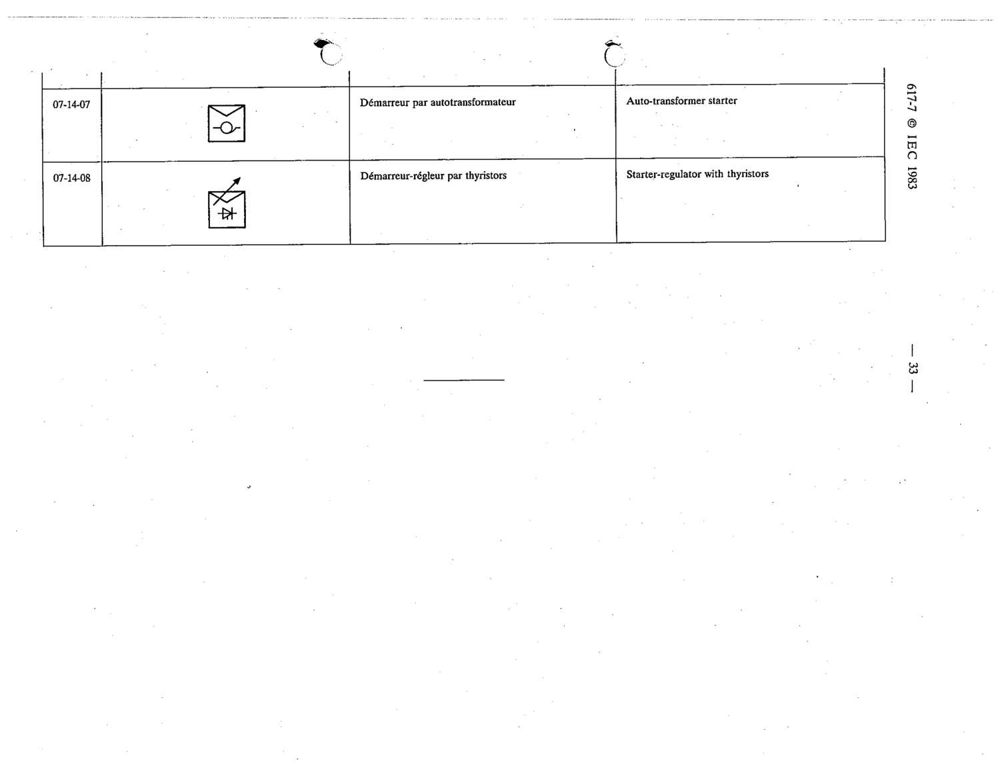

# 07-14-08 — Starter-regulator with thyristors

This symbol appears on Publication No.617-7.pdf, printed p.33 (full page shown). 617-7 uses page-level images: its table layout is too irregular (intro text, notes, text-only rows) for reliable per-symbol cropping.

**Standard:** [[60617-7]] · **Section:** [[60617-7-14-block-symbols-for-motor]]

## Description
Starter-regulator with thyristors

## Names
- **EN:** Starter-regulator with thyristors
- **FR:** Démarreur-régleur par thyristors

