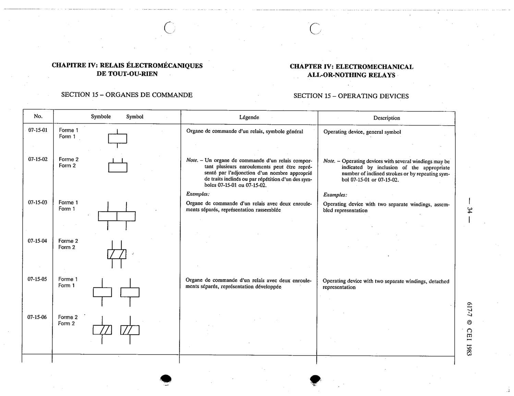

# 07-15-03 — Operating device with two separate windings, assembled representation

This symbol appears on Publication No.617-7.pdf, printed p.34 (full page shown). 617-7 uses page-level images: its table layout is too irregular (intro text, notes, text-only rows) for reliable per-symbol cropping.

**Standard:** [[60617-7]] · **Section:** [[60617-7-15-operating-devices]] · **Form 1**

## Description
Operating device with two separate windings, assembled representation

## Names
- **EN:** Operating device with two separate windings, assembled representation
- **FR:** Organe de commande avec deux enroulements séparés, représentation rassemblée

