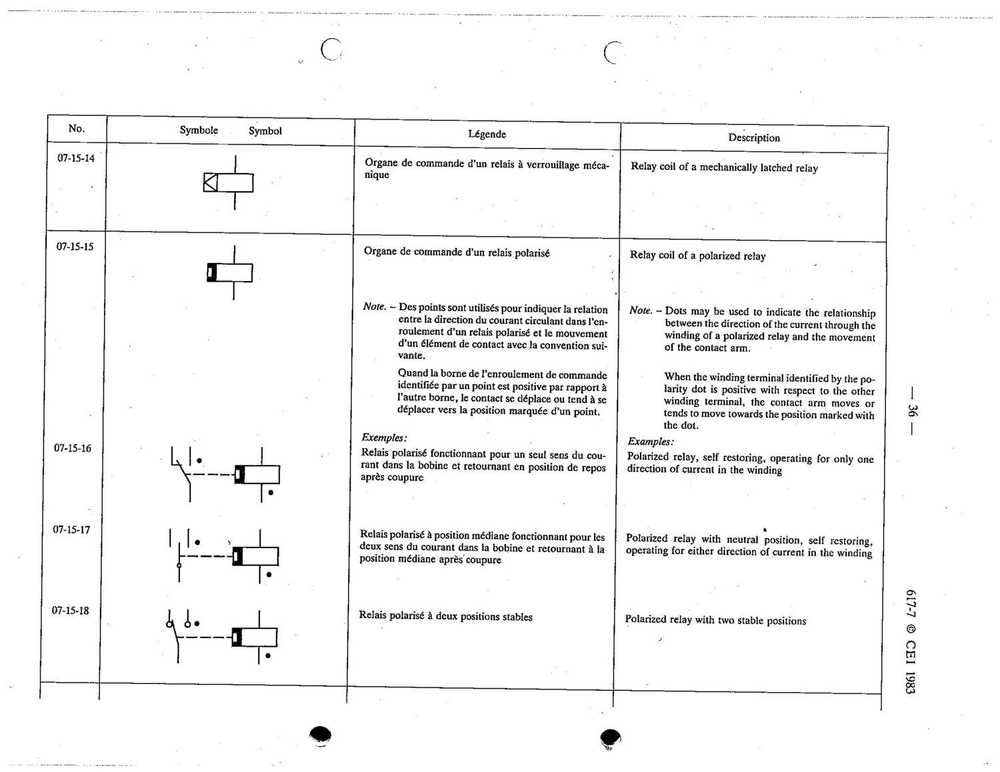

# 07-15-15 — Relay coil of a polarized relay

This symbol appears on Publication No.617-7.pdf, printed p.36 (full page shown). 617-7 uses page-level images: its table layout is too irregular (intro text, notes, text-only rows) for reliable per-symbol cropping.

**Standard:** [[60617-7]] · **Section:** [[60617-7-15-operating-devices]]

## Description
Relay coil of a polarized relay

## Names
- **EN:** Relay coil of a polarized relay
- **FR:** Organe de commande d'un relais polarisé

## Notes
- Dots may be used to indicate the relationship between the direction of current through the winding and the movement of the contact arm.

