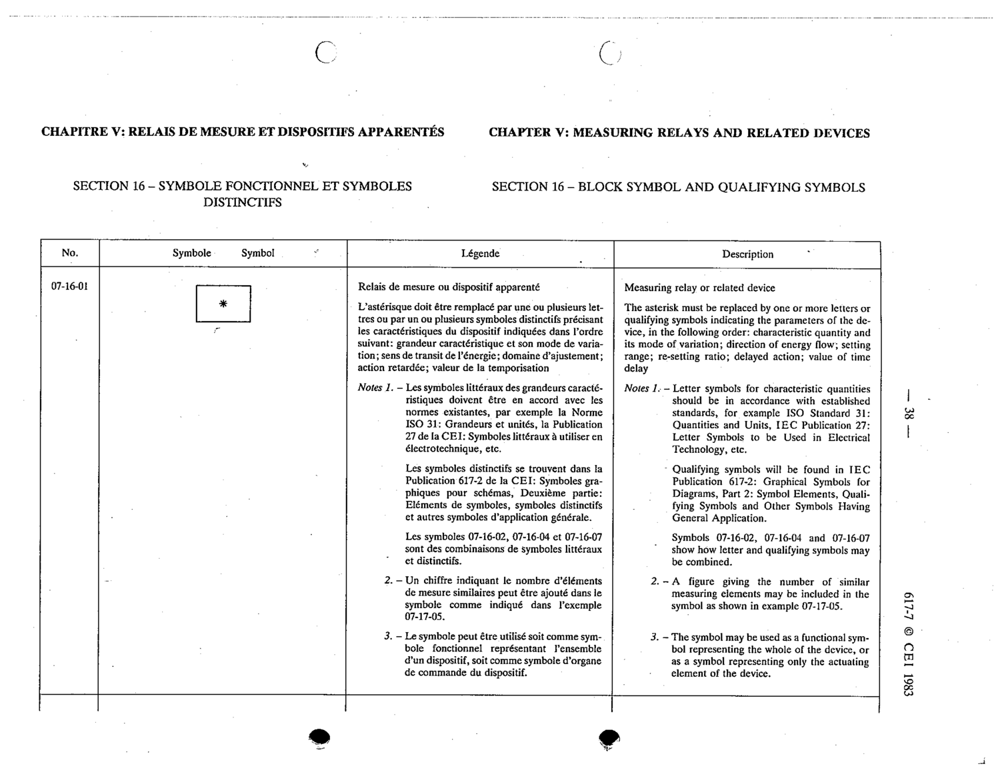

# 07-16-01 — Measuring relay or related device

This symbol appears on Publication No.617-7.pdf, printed p.38 (full page shown). 617-7 uses page-level images: its table layout is too irregular (intro text, notes, text-only rows) for reliable per-symbol cropping.

**Standard:** [[60617-7]] · **Section:** [[60617-7-16-block-symbol-and-qualifying]]

## Description
Measuring relay or related device. The asterisk must be replaced by one or more letters or qualifying symbols indicating the parameters of the device, in order: characteristic quantity and its mode of variation; direction of energy flow; setting range; re-setting ratio; delayed action; value of time range.

## Names
- **EN:** Measuring relay or related device
- **FR:** Relais de mesure ou dispositif apparenté

## Notes
- Letter symbols for characteristic quantities should be in accordance with established standards, e.g. ISO 31 and IEC 27. Qualifying symbols are in IEC 617-2. Symbols 07-16-02, 07-16-04 and 07-16-07 show how letter and qualifying symbols may be combined.
- A figure giving the number of similar measuring elements may be included, as shown for 07-17-05.
- The symbol may represent the whole device or only its actuating element.

## Related
- **ISO 31**
- **IEC 27**
- [[60617-2]]
- [[07-17-05]]
