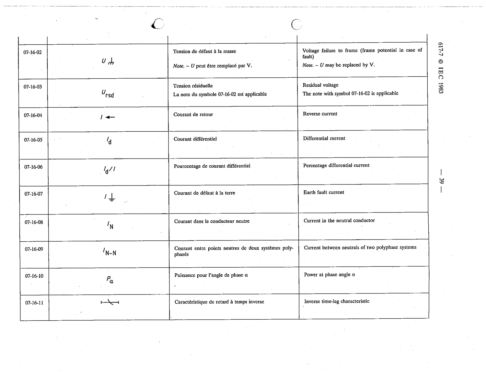

# 07-16-04 — Reverse current

This symbol appears on Publication No.617-7.pdf, printed p.39 (full page shown). 617-7 uses page-level images: its table layout is too irregular (intro text, notes, text-only rows) for reliable per-symbol cropping.

**Standard:** [[60617-7]] · **Section:** [[60617-7-16-block-symbol-and-qualifying]]

## Description
Reverse current

## Names
- **EN:** Reverse current
- **FR:** Courant de retour

