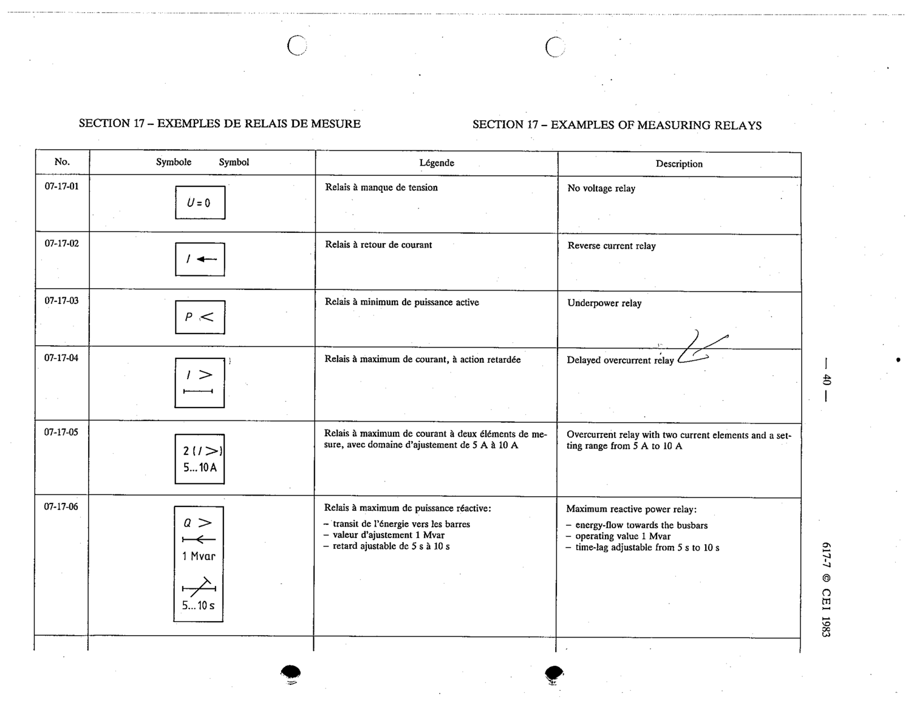

# 07-17-03 — Underpower relay

This symbol appears on Publication No.617-7.pdf, printed p.40 (full page shown). 617-7 uses page-level images: its table layout is too irregular (intro text, notes, text-only rows) for reliable per-symbol cropping.

**Standard:** [[60617-7]] · **Section:** [[60617-7-17-examples-of-measuring-relays]]

## Description
Underpower relay

## Names
- **EN:** Underpower relay
- **FR:** Relais à minimum de puissance active

