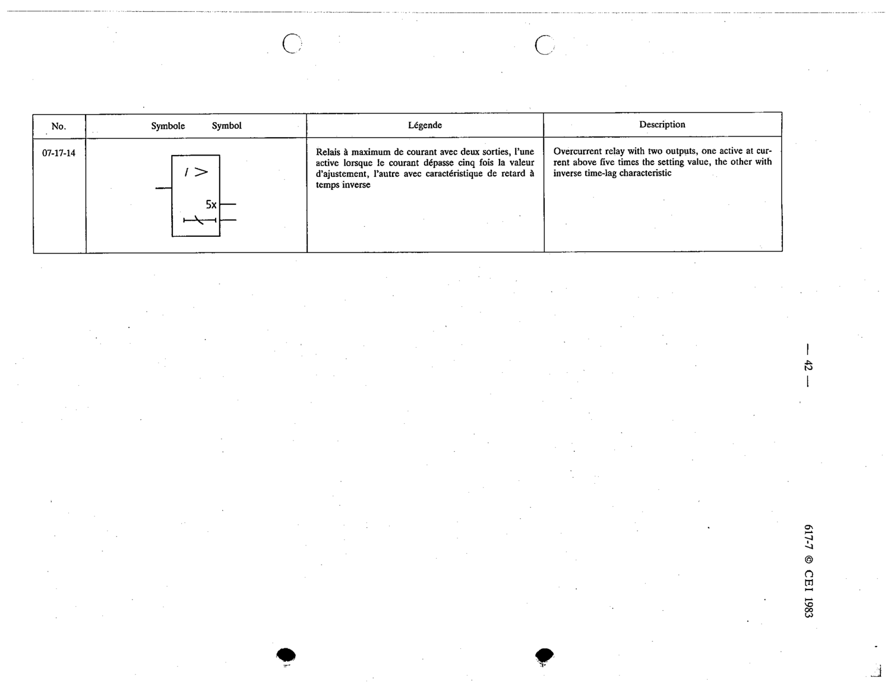

# 07-17-14 — Overcurrent relay with two outputs (one above 5× setting, one inverse time-lag)

This symbol appears on Publication No.617-7.pdf, printed p.42 (full page shown). 617-7 uses page-level images: its table layout is too irregular (intro text, notes, text-only rows) for reliable per-symbol cropping.

**Standard:** [[60617-7]] · **Section:** [[60617-7-17-examples-of-measuring-relays]]

## Description
Overcurrent relay with two outputs, one active at current above five times the setting value, the other with inverse time-lag characteristic

## Names
- **EN:** Overcurrent relay with two outputs (one above 5× setting, one inverse time-lag)
- **FR:** Relais à maximum de courant avec deux sorties

