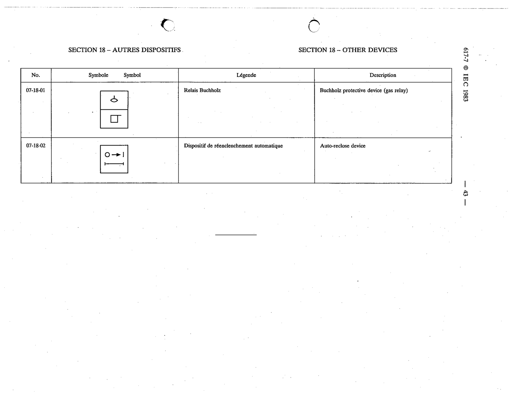

# 07-18-01 — Buchholz protective device (gas relay)

This symbol appears on Publication No.617-7.pdf, printed p.43 (full page shown). 617-7 uses page-level images: its table layout is too irregular (intro text, notes, text-only rows) for reliable per-symbol cropping.

**Standard:** [[60617-7]] · **Section:** [[60617-7-18-other-devices]]

## Description
Buchholz protective device (gas relay)

## Names
- **EN:** Buchholz protective device (gas relay)
- **FR:** Relais Buchholz

