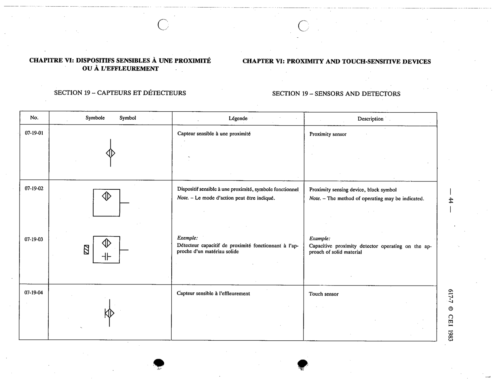

# 07-19-02 — Proximity sensing device, block symbol

This symbol appears on Publication No.617-7.pdf, printed p.44 (full page shown). 617-7 uses page-level images: its table layout is too irregular (intro text, notes, text-only rows) for reliable per-symbol cropping.

**Standard:** [[60617-7]] · **Section:** [[60617-7-19-sensors-and-detectors]]

## Description
Proximity sensing device, block symbol

## Names
- **EN:** Proximity sensing device, block symbol
- **FR:** Dispositif sensible à une proximité, symbole fonctionnel

## Notes
- The method of operating may be indicated.

