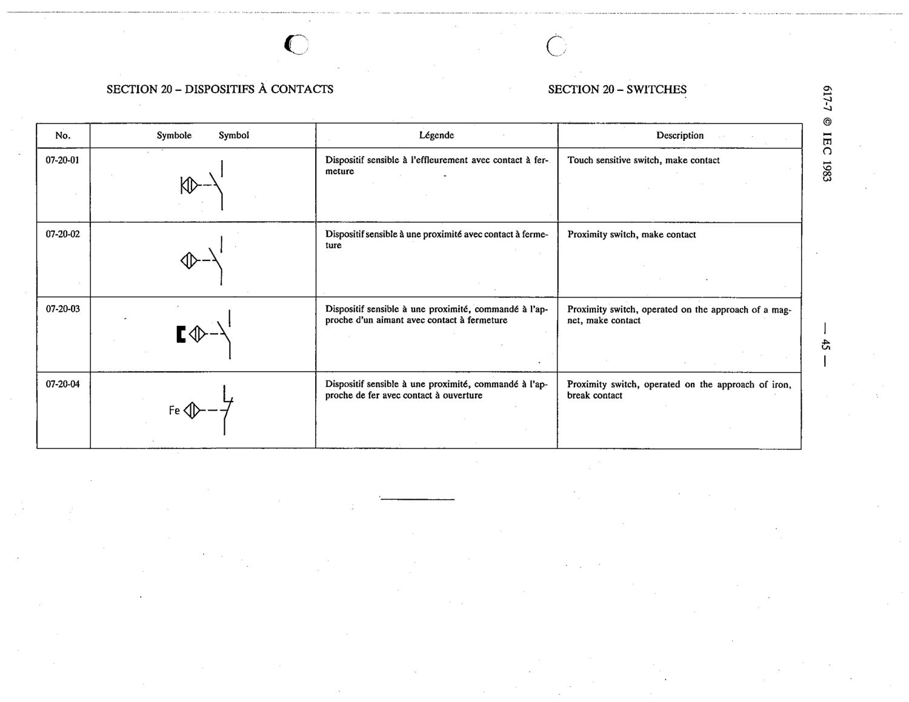

# 07-20-02 — Proximity switch, make contact

This symbol appears on Publication No.617-7.pdf, printed p.45 (full page shown). 617-7 uses page-level images: its table layout is too irregular (intro text, notes, text-only rows) for reliable per-symbol cropping.

**Standard:** [[60617-7]] · **Section:** [[60617-7-20-switches-sensor-operated]]

## Description
Proximity switch, make contact

## Names
- **EN:** Proximity switch, make contact
- **FR:** Dispositif sensible à une proximité avec contact à fermeture

