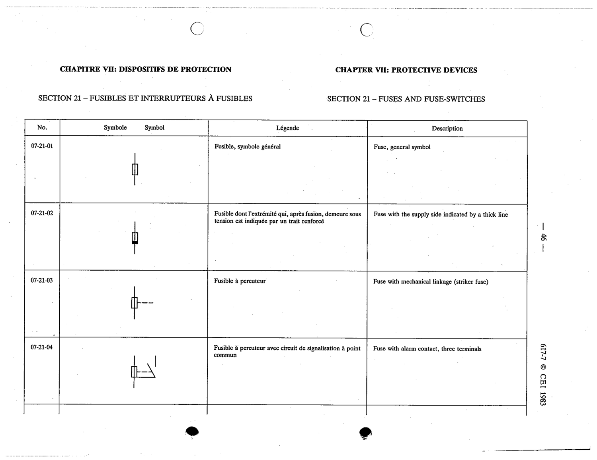

# 07-21-04 — Fuse with alarm contact, three terminals

This symbol appears on Publication No.617-7.pdf, printed p.46 (full page shown). 617-7 uses page-level images: its table layout is too irregular (intro text, notes, text-only rows) for reliable per-symbol cropping.

**Standard:** [[60617-7]] · **Section:** [[60617-7-21-fuses-and-fuse-switches]]

## Description
Fuse with alarm contact, three terminals

## Names
- **EN:** Fuse with alarm contact, three terminals
- **FR:** Fusible à percuteur avec circuit de signalisation à point commun

