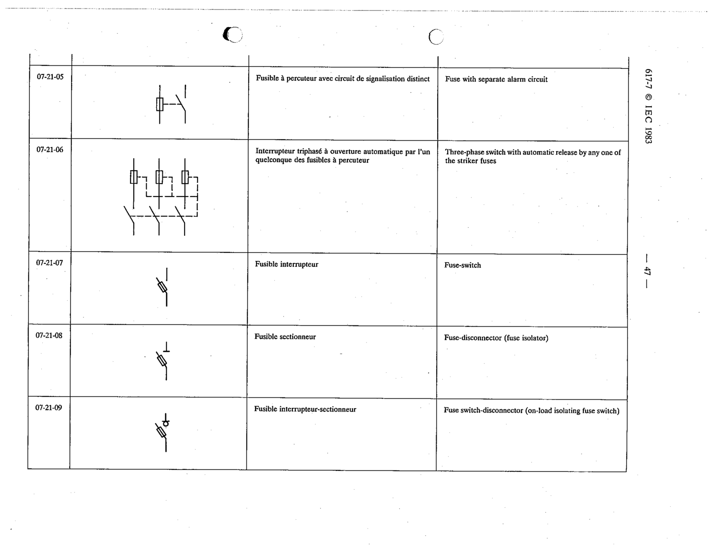

# 07-21-08 — Fuse-disconnector (fuse isolator)

This symbol appears on Publication No.617-7.pdf, printed p.47 (full page shown). 617-7 uses page-level images: its table layout is too irregular (intro text, notes, text-only rows) for reliable per-symbol cropping.

**Standard:** [[60617-7]] · **Section:** [[60617-7-21-fuses-and-fuse-switches]]

## Description
Fuse-disconnector (fuse isolator)

## Names
- **EN:** Fuse-disconnector (fuse isolator)
- **FR:** Fusible sectionneur

