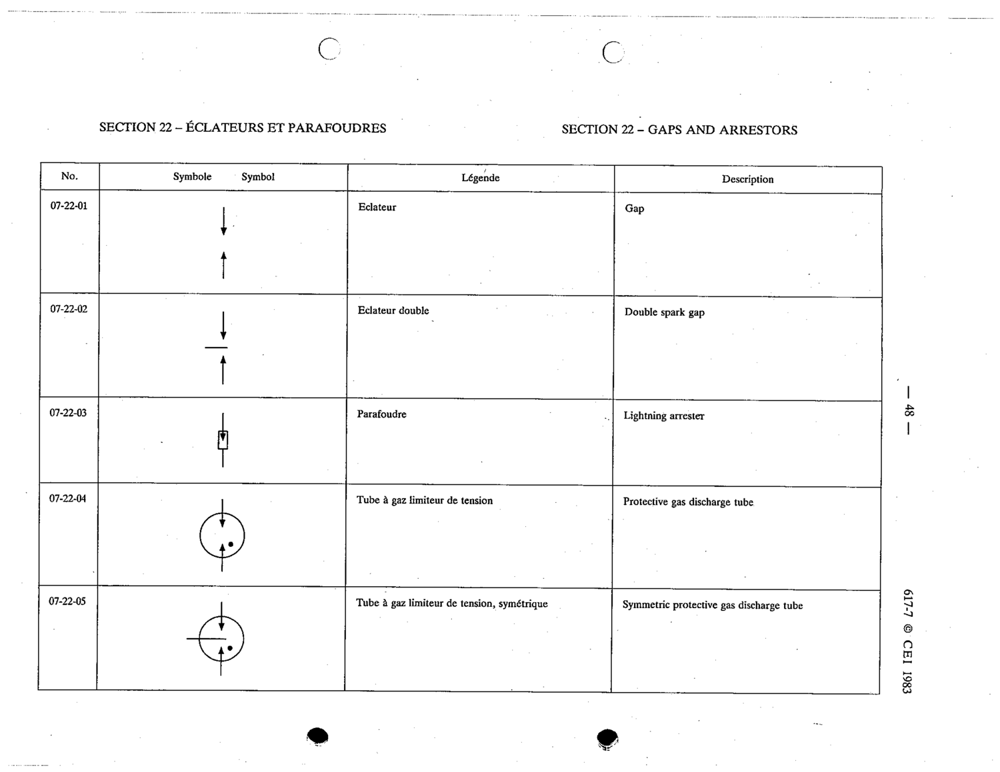

# 07-22-02 — Double spark gap

This symbol appears on Publication No.617-7.pdf, printed p.48 (full page shown). 617-7 uses page-level images: its table layout is too irregular (intro text, notes, text-only rows) for reliable per-symbol cropping.

**Standard:** [[60617-7]] · **Section:** [[60617-7-22-gaps-and-arresters]]

## Description
Double spark gap

## Names
- **EN:** Double spark gap
- **FR:** Éclateur double

